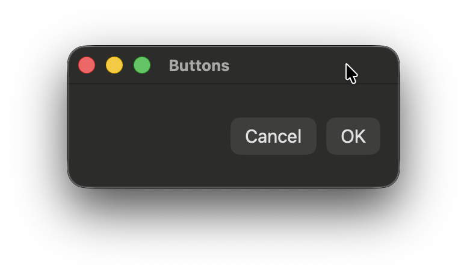
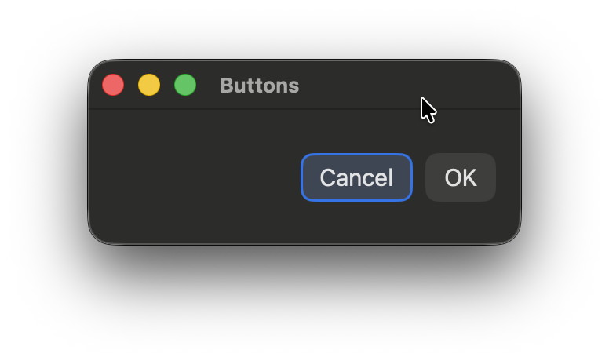
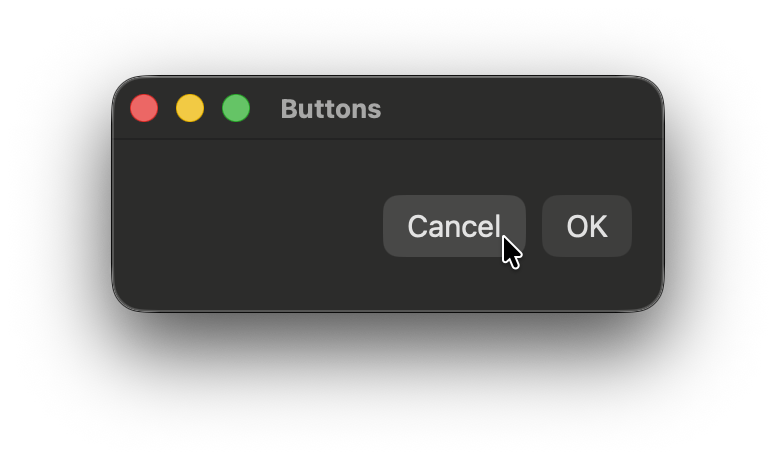

# FocusableButton

Keyboard-focusable buttons for **macOS SwiftUI**.

FocusableButton solves this by introducing a global keyboard navigation mode:
- Keyboard mode starts only after the user presses Tab
- Mouse interaction disables keyboard mode
- All focusable controls participate in the key loop only in keyboard mode
This matches native macOS UX expectations.

<p float="left">
  
  
  
</p>

## Installation (Swift Package Manager)

Add package in Xcode:

File → Add Packages Dependencies… → https://github.com/Eugene-Kugut/FocusableButton.git

## Usage

```swift
import SwiftUI
import FocusableButton

struct DemoView: View {

    var body: some View {
        FocusableButton(
            title: "OK",
            action: {
                ...
            }
        )
    }
}
```

## Customization

```swift
FocusableButton(
    title: "OK",
    font: .title3,
    verticalPadding: 6,
    horizontalPadding: 12,
    cornerRadius: 8,
    selectedBackground: Color.primary.opacity(0.10),
    focusedBackground: Color.accentColor.opacity(0.12),
    focusedOverlay: Color.accentColor.opacity(0.9),
    hoveredBackground: Color.primary.opacity(0.06),
    pressedBackground: Color.primary.opacity(0.14),
    triggerOnMouseDown: false,
    action: {}
)
```

